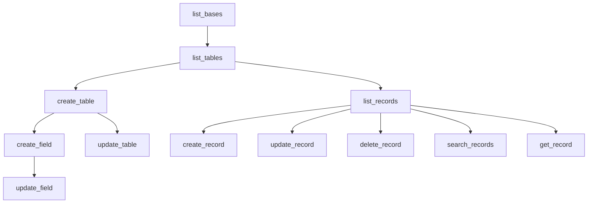

# Airtable MCP Server Guide

## Table of Contents
1. [MCP Server Tools Overview](#mcp-server-tools-overview)
   - Available Tools and Use Cases
   - Tool Dependencies and Workflow
   - Rate Limiting and Performance
   - Tool Authorization Requirements

2. [Base Management](#base-management)
   - Listing and Discovering Bases
   - Table Operations
   - Base Configuration
   - Access Control

3. [Field Management](#field-management)
   - Field Types and Options
   - Field Creation and Updates
   - Field Dependencies
   - Data Validation

4. [Record Operations](#record-operations)
   - Reading and Querying Records
   - Creating and Updating Records
   - Batch Operations
   - Search and Filtering

## MCP Server Tools Overview

### Available Tools and Use Cases

1. **Base Management Tools**

   a. **list_bases**
   - **Purpose**: Lists all accessible Airtable bases
   - **Key Considerations**:
     - Requires valid API key
     - Returns only bases with access permissions
     - Useful for initial discovery
   - **Best Practices**:
     - Cache base IDs for frequent operations
     - Verify base accessibility before operations
     - Handle pagination if many bases

   b. **list_tables**
   - **Purpose**: Lists all tables in a specified base
   - **Key Considerations**:
     - Requires base_id
     - Returns table metadata
     - Useful for table discovery
   - **Best Practices**:
     - Cache table IDs for frequent operations
     - Verify table existence before operations
     - Handle pagination for large bases

   c. **create_table**
   - **Purpose**: Creates a new table in an Airtable base
   - **Key Considerations**:
     - Requires base_id and table name
     - Can create multiple basic fields in one operation
     - Should be used first in any table creation workflow
     - Validate table name uniqueness in the base
   - **Best Practices**:
     - Start with essential basic fields only
     - Use clear, descriptive table names
     - Add proper table description
     - Follow naming conventions

   d. **update_table**
   - **Purpose**: Updates a table's name or description
   - **Key Considerations**:
     - Requires base_id and table_id
     - Can modify name and description
     - Existing data remains unchanged
   - **Best Practices**:
     - Verify table existence before update
     - Maintain naming consistency
     - Update documentation accordingly

2. **Field Management Tools**

   a. **create_field**
   - **Purpose**: Adds a new field to an existing table
   - **Key Considerations**:
     - Requires both base_id and table_id
     - Add one field at a time for complex types
     - Field options must match type requirements
   - **Best Practices**:
     - Verify field creation before adding next
     - Use descriptive field names
     - Include field descriptions
     - Configure appropriate field options

   b. **update_field**
   - **Purpose**: Modifies existing field configuration
   - **Key Considerations**:
     - Can update name, description, and options
     - Some field types have immutable properties
     - Changes may affect existing data
   - **Best Practices**:
     - Backup data before significant changes
     - Test changes on sample records
     - Update documentation accordingly
     - Verify field behavior after changes

3. **Record Operation Tools**

   a. **list_records**
   - **Purpose**: Retrieves records from a table
   - **Key Considerations**:
     - Supports filtering and sorting
     - Handles pagination
     - Can specify fields to return
   - **Best Practices**:
     - Use field selection for performance
     - Implement pagination for large datasets
     - Cache results when appropriate
     - Handle rate limits

   b. **create_record**
   - **Purpose**: Adds new records to a table
   - **Key Considerations**:
     - Validates field types
     - Handles required fields
     - Supports multiple records
   - **Best Practices**:
     - Validate data before submission
     - Handle batch operations efficiently
     - Verify record creation
     - Implement error recovery

   c. **update_record**
   - **Purpose**: Modifies existing records
   - **Key Considerations**:
     - Requires record ID
     - Partial updates supported
     - Field validation applied
   - **Best Practices**:
     - Verify record existence
     - Backup data before updates
     - Handle field type constraints
     - Log changes for audit

   d. **delete_record**
   - **Purpose**: Removes records from a table
   - **Key Considerations**:
     - Operation is irreversible
     - Can affect linked records
     - Supports batch deletion
   - **Best Practices**:
     - Verify record selection
     - Backup before deletion
     - Check dependencies
     - Implement confirmation

   e. **search_records**
   - **Purpose**: Finds records matching criteria
   - **Key Considerations**:
     - Supports complex filters
     - Can use multiple fields
     - Returns paginated results
   - **Best Practices**:
     - Optimize search criteria
     - Handle no results case
     - Implement pagination
     - Cache frequent searches

   f. **get_record**
   - **Purpose**: Retrieves a single record by ID
   - **Key Considerations**:
     - Direct record access
     - Returns all or selected fields
     - Efficient for single record ops
   - **Best Practices**:
     - Verify record existence
     - Handle missing records
     - Select needed fields only
     - Cache when appropriate

### Tool Dependencies and Workflow

### Rate Limiting and Performance

1. **API Constraints**
   - Respect Airtable's rate limits
   - Implement exponential backoff
   - Handle throttling gracefully
   - Monitor API usage

2. **Operation Timing**
   - Allow time between operations
   - Verify completion before next step
   - Handle timeouts appropriately
   - Log operation durations

3. **Resource Management**
   - Monitor memory usage
   - Clean up temporary resources
   - Handle connection issues
   - Implement proper error recovery

### Tool Authorization Requirements

1. **Authentication**
   - Personal access token required
   - OAuth integration support
   - Proper scope configuration
   - Token management best practices

2. **Permissions**
   - Base creator role needed
   - Verify write permissions
   - Check field-level access
   - Handle permission errors

## Base Management

## Table Management

### Available Table Tools

1. **list_tables**
   - **Purpose**: Lists all tables in a specified base
   - **Key Considerations**:
     - Requires base_id
     - Returns table metadata
     - Useful for table discovery
   - **Best Practices**:
     - Cache table IDs for frequent operations
     - Verify table existence before operations
     - Handle pagination for large bases

2. **create_table**
   - **Purpose**: Creates a new table in an Airtable base
   - **Key Considerations**:
     - Requires base_id and table name
     - Can create multiple basic fields in one operation
     - Should be used first in any table creation workflow
     - Validate table name uniqueness in the base
   - **Best Practices**:
     - Start with essential basic fields only
     - Use clear, descriptive table names
     - Add proper table description
     - Follow naming conventions

3. **update_table**
   - **Purpose**: Updates a table's name or description
   - **Key Considerations**:
     - Requires base_id and table_id
     - Can modify name and description
     - Existing data remains unchanged
   - **Best Practices**:
     - Verify table existence before update
     - Maintain naming consistency
     - Update documentation accordingly

### Table Creation Workflow

1. **Initial Setup**
   - Verify base access
   - Check table name availability
   - Plan table structure
   - Define primary fields

2. **Field Planning**
   - Start with basic fields
   - Plan relationships with other tables
   - Consider computed fields
   - Define field dependencies

3. **Implementation Steps**
   - Create table with basic fields
   - Add complex fields incrementally
   - Set up relationships
   - Configure views and permissions

### Best Practices

1. **Table Design**
   - Use clear, descriptive names
   - Follow consistent naming conventions
   - Include proper descriptions
   - Plan for scalability
   - Consider relationships early

2. **Data Organization**
   - Group related fields logically
   - Use appropriate field types
   - Plan for future expansion
   - Consider data validation needs
   - Document table relationships

3. **Performance Considerations**
   - Optimize field types for data size
   - Plan indexes for frequent queries
   - Consider record limits
   - Monitor table size
   - Handle large datasets efficiently

4. **Security and Access**
   - Set appropriate permissions
   - Document access requirements
   - Plan sharing strategy
   - Consider data sensitivity
   - Implement proper controls

### Common Patterns

1. **Master-Detail Tables**
   - Primary table contains main records
   - Detail tables link to master
   - Use lookup fields for data access
   - Implement proper relationships

2. **Lookup Tables**
   - Store reference data
   - Use for standardization
   - Minimize redundancy
   - Easy maintenance

3. **Junction Tables**
   - Handle many-to-many relationships
   - Store relationship metadata
   - Enable complex queries
   - Maintain data integrity

### Error Handling

1. **Creation Errors**
   - Handle name conflicts
   - Validate field configurations
   - Check permissions
   - Provide clear error messages

2. **Update Errors**
   - Verify table existence
   - Check field dependencies
   - Handle concurrent updates
   - Maintain data integrity

3. **Deletion Considerations**
   - Check for dependencies
   - Backup important data
   - Handle cascading deletes
   - Verify permissions